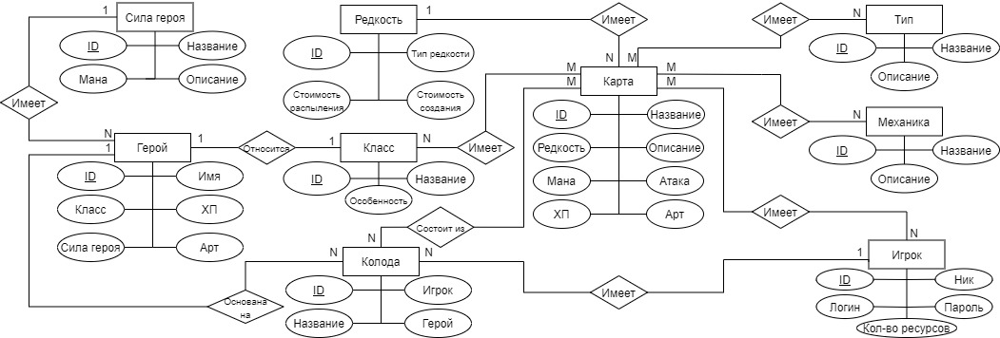
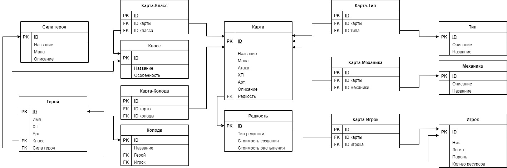
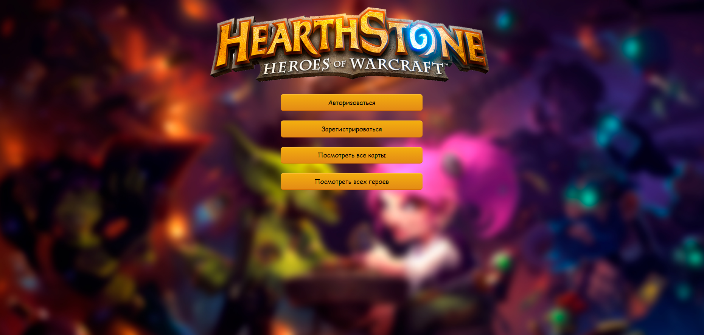
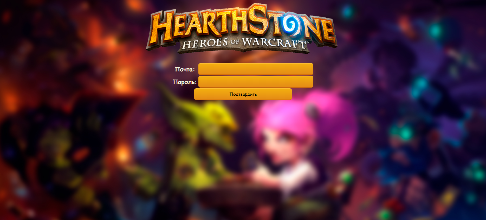
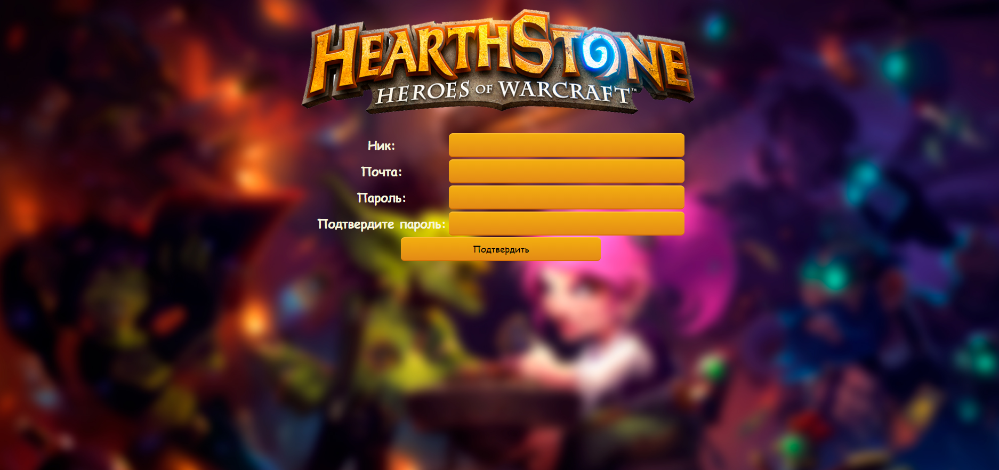
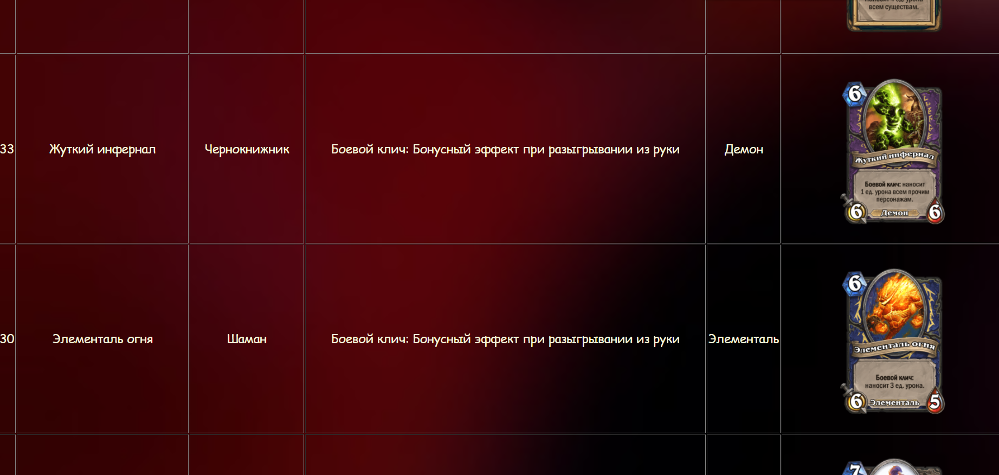
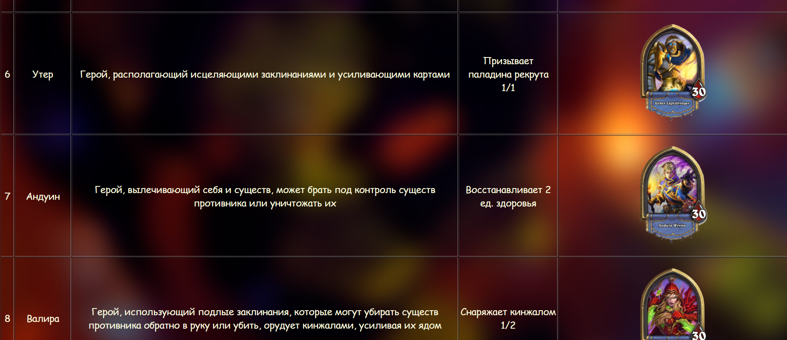
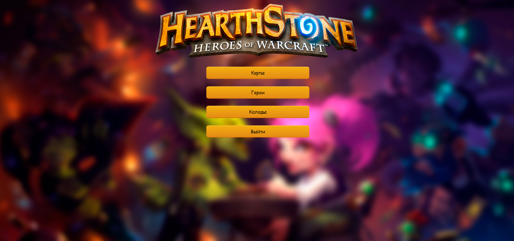
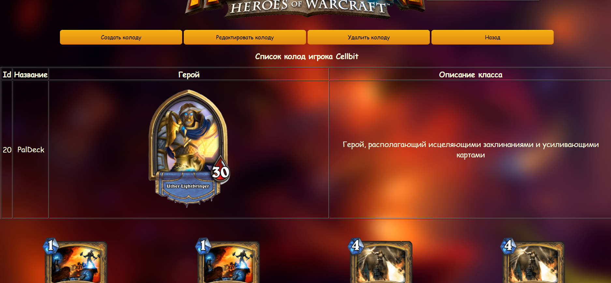
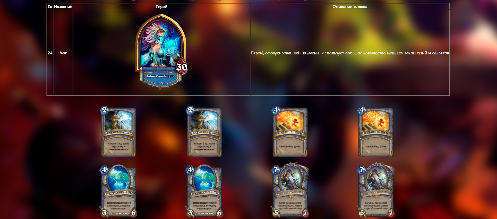

# Веб-приложение для создания колод по игре Hearthstone

Веб-приложение на основе django + postgresql, которое предоставляет пользователю возможность
регистрации аккаунта для последующего создания различных колод. Все материалы: герои и карты взяты из карточной игры Hearthstone

# Диаграмма "Сущность-связь" используемой БД

# Схема структуры БД

# Скриншоты работы приложения

___